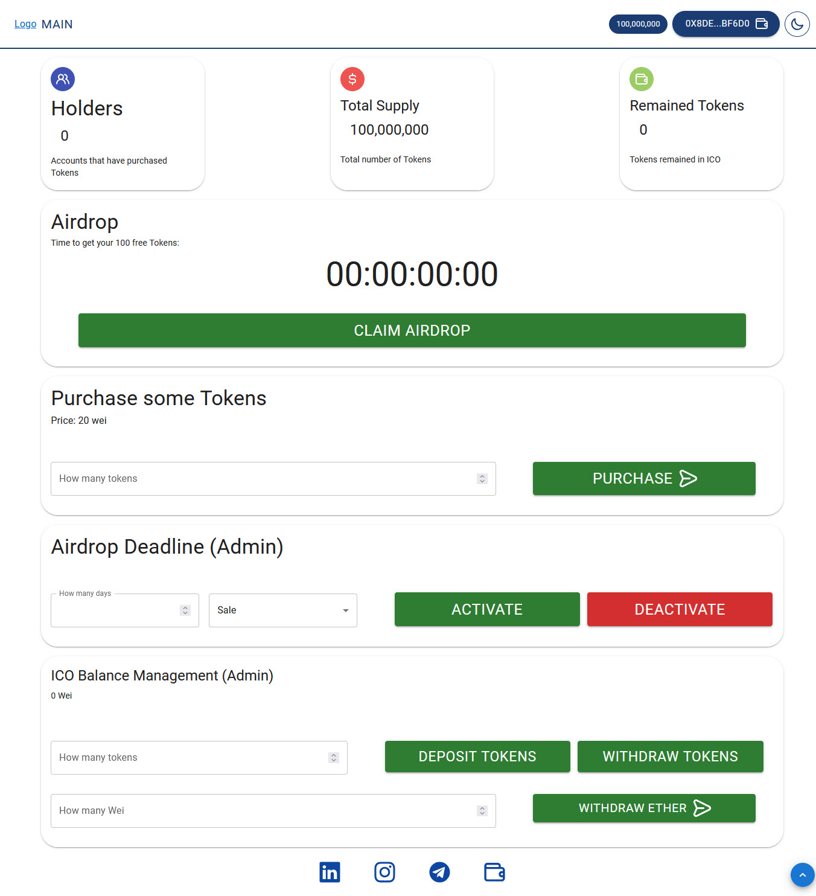

# ICO


An initial coin offering (ICO) is a way for cryptocurrency startups to raise capital. Here's how it works:

- The startup creates a new digital token or digital currency.
- They offer these tokens to early investors in exchange for well-known cryptocurrencies such as Bitcoin or Ethereum.
- ICOs allow startups to raise capital without giving up their shares, and investors hope that the value of the token will increase if the project is successful.
  In this app, you can easily create an ESO for your token

## Clone Repository

```sh
git clone https://github.com/mahdiZarrei/ICO.git
cd ICO
```

## Requirements

[node.js](https://nodejs.org/en/) v10.18.0+ And [Metamask](https://metamask.io/) extension on your browser

## Installation

Use the package manager [npm](https://www.npmjs.com/) to install ICO.

```bash
npm install
```

## Usage

```bash
npm run dev
```

Open `localhost:5173` to access the application!

## Photo gallery

### user Login page


### made page


### ICO page



## License

MIT
